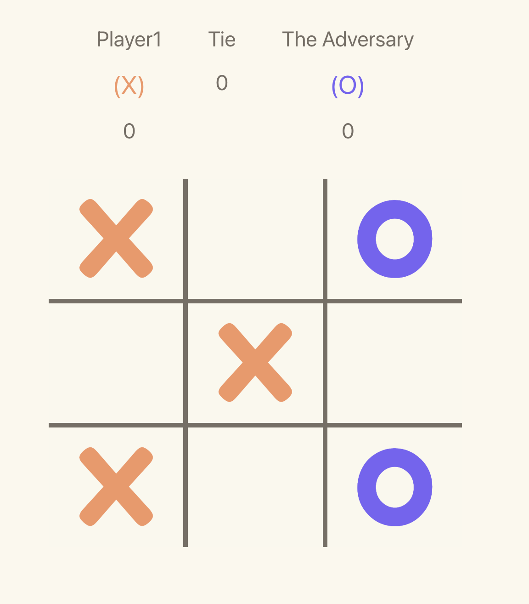

# Tic-Tac-Toe

This is a 2-player Tic-Tac-Toe game built with React.



**You can play it here:** https://feralonsomaccari.github.io/tic-tac-toe/

**Or you can also set it up locally.**

## Description

This was part of an interview take-home assessment. For practical reasons and to meet the project deadline, 
I decided to use `create-react-app` and `CSS Modules` for styling without any preprocessor, as well as vanilla JavaScript. For more complex projects, TypeScript and a CSS preprocessor or styled-components should be strongly considered.

I followed the `BEM` convention and a `mobile-first` approach for styling and layout.

`React Testing Library` has been used for unit testing.

I ran out of time to add `PropTypes`, but I highly recommend using them in any project.

## The Game

The game starts with a main menu where players can enter their names. The game will not start if the player names are empty, identical, or contain special characters.

The game records every match for each player and keeps the score using React Context. Please keep in mind that if the site is refreshed, all records will be lost.

If the players have played before and Player 2 (O) won the last match, the marks will automatically swap, and Player 2 will become X.

There is also a leaderboard where users can see the full game history and which player is leading.

**Have some fun playing!**

## Local Setup

```sh
Clone it
npm i
npm run start
```
